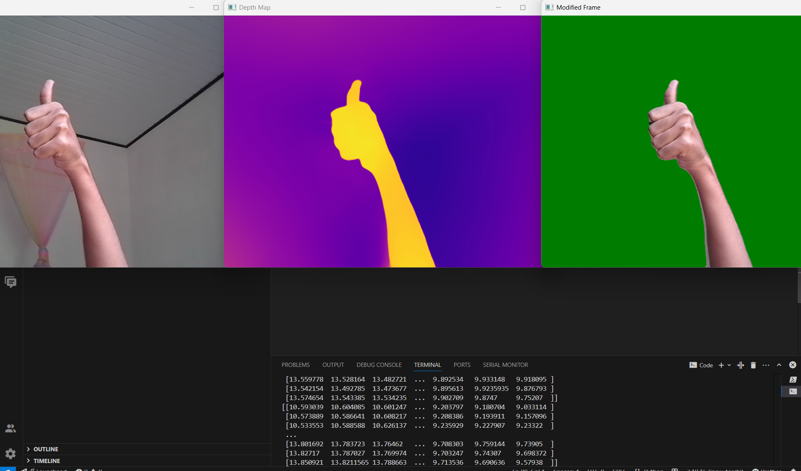
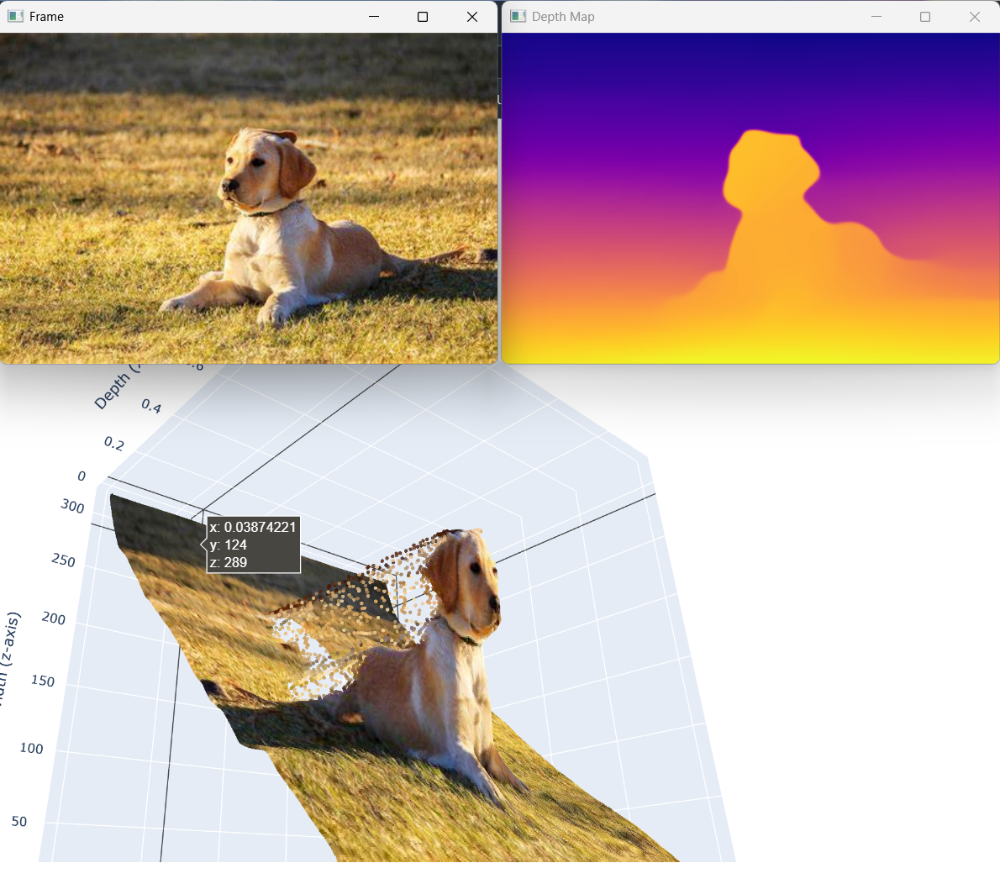

# MiDaS Depth Estimation Projects

This repository contains two simple use-case implementations of the [MiDaS](https://github.com/intel-isl/MiDaS) depth estimation model using PyTorch. The two projects demonstrate:

1. **Real-time depth-based background removal** using a webcam.  
2. **3D visualization of depth maps** using Plotly for a static image.

---

## 🔧 Requirements

Install the following dependencies before running the code:

```bash
pip install torch torchvision opencv-python plotly timm kaleido
```

> `kaleido` is required for saving the 3D plot image in Project 2.

Make sure you also have a working webcam and a compatible GPU (optional, but recommended).

---

## 📁 Project 1: Real-Time Background Removal

This script captures frames from your webcam, uses MiDaS to estimate depth, and removes the background based on a depth threshold.

### 🔹 Features

- Uses `DPT_Large` model from MiDaS  
- Replaces background with a custom color (`[0, 125, 0]`)  
- Real-time processing using webcam feed  
- Visualizes original frame, depth map, and modified output  

### 🔹 How to Run

```bash
python background_removal.py
```

Make sure your webcam is accessible. Press `q` to exit.

### 💾 How to Save Output Images

Inside the main loop, you can save one frame like this:

```python
os.makedirs("samples", exist_ok=True)

if not saved:
    cv.imwrite("samples/original_frame.jpg", frame_1)
    cv.imwrite("samples/depth_map_live.jpg", output_colormap)
    cv.imwrite("samples/modified_frame.jpg", mod_frame)
    saved = True
```
### 📸 Sample Output




---

## 📁 Project 2: Static Image 3D Depth Visualization

This script loads a static image and visualizes its depth map in 3D using Plotly.

### 🔹 Features

- Uses MiDaS to estimate depth of a static image (`dog.jpg`)
- Displays 3D scatter plot where:
  - **x-axis** = depth
  - **y-z plane** = image pixels
- Visualizes colored depth map and original image

### 🔹 How to Run

```bash
python depth_3d_plot.py
```

Make sure you have an image named `dog.jpg` in the same directory.

### 💾 How to Save Output Images

Add this to the script after displaying the images:

```python
os.makedirs("samples", exist_ok=True)

# Save original and depth map
cv.imwrite("samples/dog.jpg", cv.cvtColor(frame, cv.COLOR_RGB2BGR))
cv.imwrite("samples/depth_map_dog.jpg", output_colormap)

# Save 3D plot image
fig.write_image("samples/3d_plot_dog.png")
```

### 📸 Sample Output

 
---

## 🧠 Model Info

Model used in both projects:  
- `DPT_Large` from the [intel-isl/MiDaS](https://github.com/intel-isl/MiDaS) PyTorch Hub repository  
- Transformations handled using MiDaS's default `dpt_transform`

---

## ✅ Notes

- GPU acceleration (CUDA) is used if available.
- You can change the `threshold` value in `remove_bg()` to control background sensitivity.
- Replace `dog.jpg` with any other image in Project 2 for testing.

---

## ✍️ Author

Created by **Shehan Perera**  
For experimentation and learning purposes using MiDaS.

---
